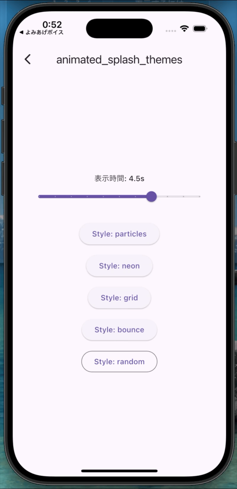

# animated_splash_themes

A Flutter package providing richly animated splash screens with 4 built-in styles.

## Styles

| particles | neon | grid | bounce |
|-----------|------|------|--------|
|  |  |  |  |
| Teal gradient with floating particles and glow effects | Dark background with neon glow, corner brackets, and scan lines | Light gray with grid background and orbital animation | Colorful gradient with jumping icon and rotating ring |

`random` — randomly picks one of the above at runtime.

## Installation

```yaml
dependencies:
  animated_splash_themes: ^1.0.0
```

## Usage

```dart
import 'package:animated_splash_themes/animated_splash_themes.dart';

MaterialApp(
  home: AnimatedSplashScreen(
    appName: 'My App',
    appSubtitle: 'POWERED BY AI',        // optional
    iconPath: 'assets/images/icon.png',
    theme: SplashStyle.random,
    nextScreen: const HomePage(),
  ),
)
```

### Specific style

```dart
AnimatedSplashScreen(
  appName: 'My App',
  iconPath: 'assets/images/icon.png',
  theme: SplashStyle.neon,
  nextScreen: const HomePage(),
)
```

### Custom colors

```dart
AnimatedSplashScreen(
  appName: 'My App',
  iconPath: 'assets/images/icon.png',
  theme: SplashStyle.neon,
  backgroundColors: [Color(0xFF1A0030), Color(0xFF0D001A)],
  accentColor: Colors.purple,
  nextScreen: const HomePage(),
)
```

### Custom duration

```dart
AnimatedSplashScreen(
  appName: 'My App',
  iconPath: 'assets/images/icon.png',
  theme: SplashStyle.particles,
  duration: const Duration(milliseconds: 3000),
  transitionDuration: const Duration(milliseconds: 800),
  nextScreen: const HomePage(),
)
```

## Parameters

| Parameter | Type | Required | Default | Description |
|-----------|------|----------|---------|-------------|
| `appName` | `String` | ✓ | — | Main app name displayed on splash |
| `appSubtitle` | `String?` | | — | Subtitle text below app name |
| `iconPath` | `String` | ✓ | — | Asset path to the app icon |
| `nextScreen` | `Widget` | ✓ | — | Screen to navigate to after splash |
| `theme` | `SplashStyle` | | `SplashStyle.random` | Which style to display |
| `duration` | `Duration` | | `2650ms` | How long to show the splash |
| `transitionDuration` | `Duration` | | `1200ms` | Fade transition to next screen |
| `backgroundColors` | `List<Color>?` | | style default | Background gradient colors |
| `accentColor` | `Color?` | | style default | Accent / glow color |

## Notes

- The icon image should be square (recommended: 160×160 or larger)
- Status bar style is automatically managed per style (Neon uses light icons)
- All animations are pure Flutter — no native dependencies required
